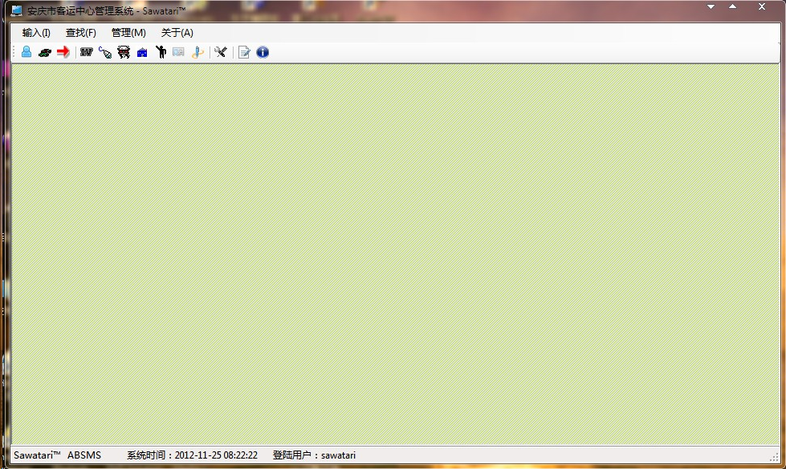

Sawatari ABSMS
==============

Sawatari Anqing Bus Station Management System (Sawatari ABSMS) is a project for Anqing Bus Station to manage buses.

This project has two modules: for tourists and for administrators.

(1) For tourists:
This module can issue tickets and return tickets. 

   

(2) For administrators:
Entering this module requires an administrator account. If you forget your password, you can find the password in this module.
   

This is the main page of this module.

   

In this module, administrators can input the informations of tourists;

Input the informations of buses;

Input the informations of bus lines;

Output the informations of tourists;

Output the informations of buses;

Output the informations of bus lines;

Manage the administrator account.

